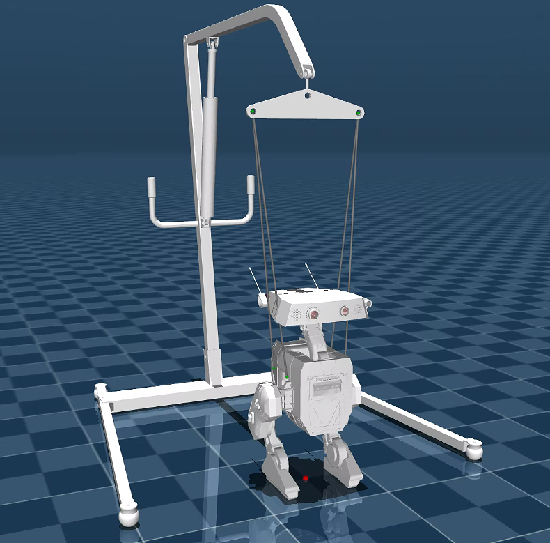
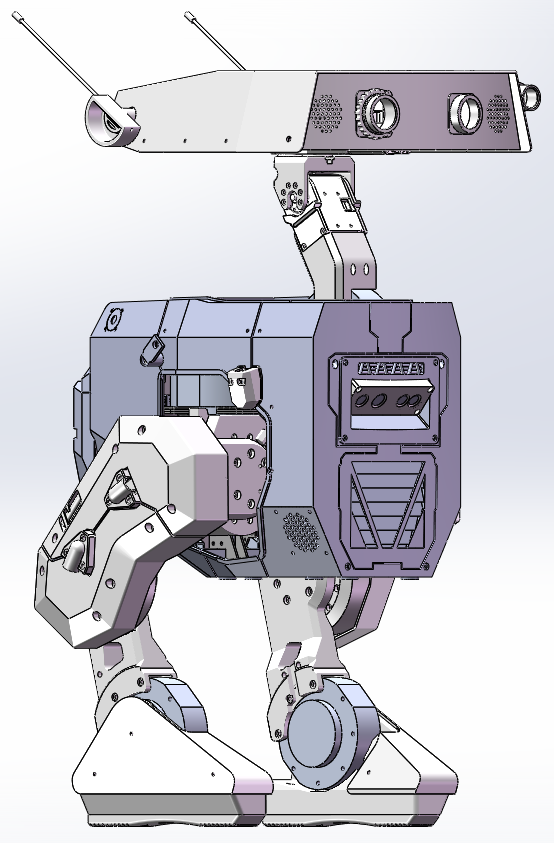
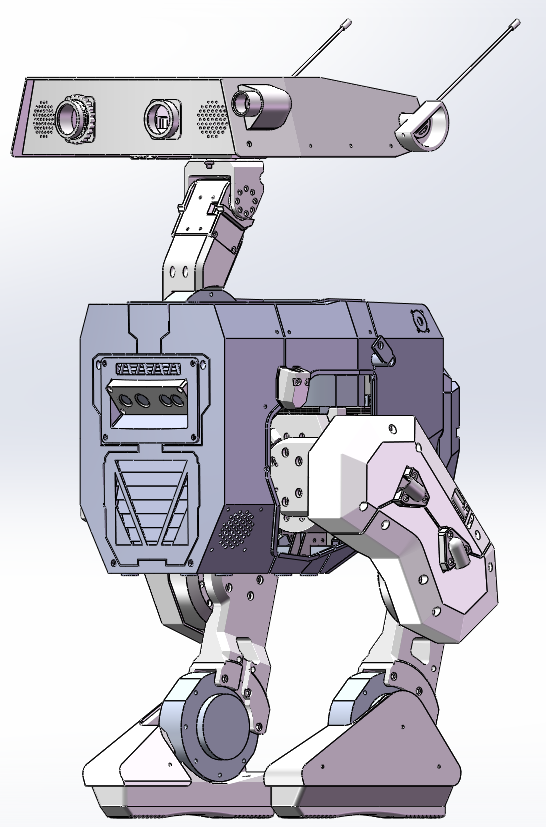

# Disney Robot URDF Project 🤖

一个完整的迪士尼风格机器人URDF模型项目，包含SolidWorks装配体设计、URDF机器人描述文件、3D打印件设计等。



## 项目概述

本项目是一个完整的迪士尼风格机器人设计项目，包含：
- **SolidWorks装配体设计** - 完整的机器人机械结构
- **URDF模型文件** - 用于机器人仿真的描述文件
- **3D打印件设计** - 外壳、连接件等可打印部件

## 项目结构
```
disneyRobotURDF/
├── 装配体/                 # SolidWorks装配体文件
│   ├── 总装.SLDASM        # 完整机器人总装图
│   ├── 头部.SLDASM        # 头部模块装配图
│   ├── 躯干.SLDASM        # 躯干模块装配图
│   ├── 左腿.SLDASM        # 左腿模块装配图
│   └── 右腿.SLDASM        # 右腿模块装配图
├── URDF/                  # 机器人描述文件
│   ├── disney_robot_BDX/  # 主要URDF模型
│   └── link/              # 链接文件
├── 零部件/                # 详细零部件设计
│   ├── 外壳打印件/        # 外壳3D打印文件
│   ├── 躯干打印件/        # 躯干打印件
│   ├── 小打印件/          # 小型连接件
│   ├── 连接板/            # 结构连接板
│   ├── 铝管/              # 铝管材料规格
│   ├── 螺丝/              # 紧固件规格
│   └── 配件/              # 其他配件
├── 移位机/                # 移动平台设计
└── 照片/                  # 项目展示照片
    ├── makeup_photo_1.png # 机器人照片1
    ├── makeup_photo_2.png # 机器人照片2
    └── makeup_photo_3.png # 机器人照片3
```

## 🚀 快速开始

### 环境要求

- **SolidWorks 2023+** - 用于查看和编辑装配体文件
- **mujoco** - 用于URDF查看
- **拓竹3D打印机** - 用于制作打印件（可选）

### 安装步骤

1. **克隆项目**
   ```bash
   git clone https://github.com/yourusername/disneyRobotURDF.git
   cd disneyRobotURDF
   ```

2. **查看装配体**
   - 使用SolidWorks打开 `装配体/总装.SLDASM`
   - 查看各模块的装配关系

3. **使用URDF模型**
   - 将 `URDF/disney_robot_BDX/` 复制到ROS工作空间
   - 在launch文件中引用URDF模型

4. **制作3D打印件**
   - 从 `零部件/` 目录选择需要的打印件
   - 使用切片软件生成G-code
   - 3D打印制作

## 使用说明

### SolidWorks装配体

- **总装图**: 展示完整机器人的装配关系
- **模块装配**: 各功能模块的详细装配步骤
- **干涉检查**: 确保各部件间无干涉
- **运动仿真**: 验证机械结构的运动性能

### URDF模型

- **机器人描述**: 完整的机器人物理参数
- **关节定义**: 各关节的运动范围和限制
- **碰撞检测**: 用于仿真的碰撞模型
- **可视化**: 支持RViz等工具的可视化

### 3D打印件

- **材料建议**: PLA/PETG/ABS等常用材料
- **打印参数**: 优化的层高、填充等参数
- **后处理**: 打磨、喷漆等表面处理建议

## 项目展示




## 联系方式
